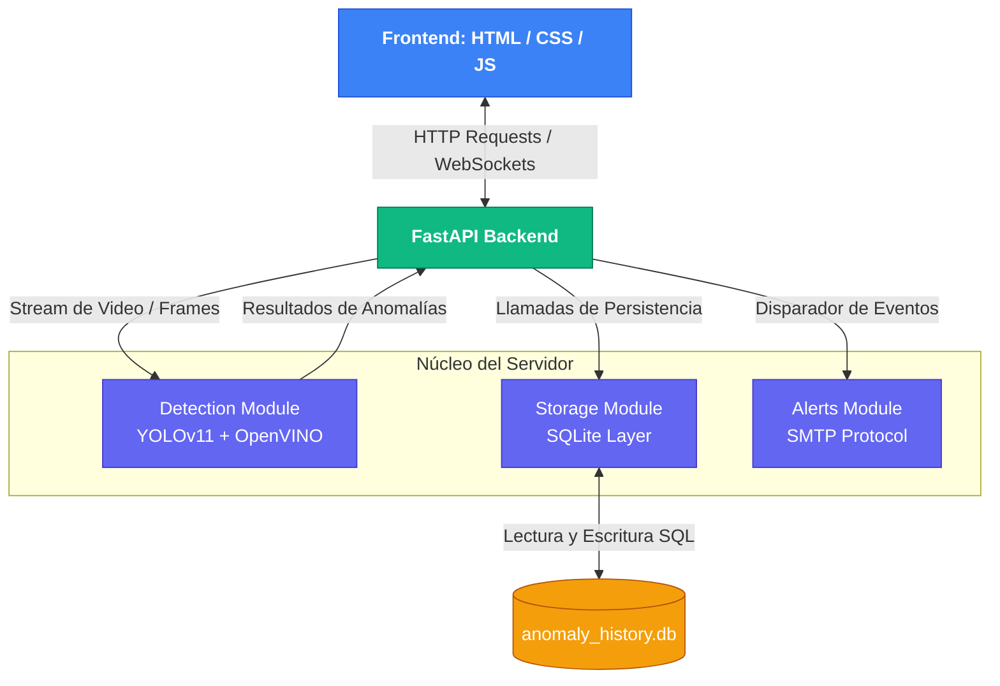

# 📹 Sistema de detección de amenazas en entornos de seguridad - CCTV

Este proyecto es un fork del repositorio [CCTV_Video_Anomaly_Detection](https://github.com/saadkhan2003/CCTV_Video_Anomaly_Detection), sistema de detección de anomalías de vídeo de alto rendimiento, impulsado por IA, diseñado para videovigilancia CCTV. Utiliza YOLOv11 con optimización OpenVINO para la detección en tiempo real en CPU estándar, e incluye una interfaz web y funciones de alerta de anomalías.

---
## 🏗️ Arquitectura del Sistema


---

## 🛠️ Inicio Rápido

### 📋 Pre-requisitos

Antes de comenzar, asegúrate de cumplir con los siguientes requerimientos en tu entorno local:

- **Python**: 3.10 o superior
- **Operating System**: Windows 10+ / Ubuntu 22.04 / macOS 12+
- **RAM**: 8 GB mínimo (16 GB recomendado)
- **Storage**: Al menos 10 GB de espacio libre (para dependencias y modelos)

### 🚀 Instalación

Sigue estos pasos en tu terminal para clonar el proyecto y preparar tu entorno de desarrollo:

1. **Clonar el repositorio**
   ```bash
   git clone [https://github.com/Sibahia/prueba-cctv-ia.git](https://github.com/Sibahia/prueba-cctv-ia)
   cd prueba-cctv-ia
   ```

2. **Crear el entorno virtual (Altamente recomendado)**
    ```bash
    python -m venv venv
    ```

    - **Activar en Linux/macOS:**
        ```bash
        source venv/bin/activate
        ```

    - **Activar en Windows:**
        ```bash
        .\venv\Scripts\Activate.ps1
        ```

3. **Instalar las dependencias**
    ```powershell
    pip install -r requirements.txt

    Nota: La primera instalación puede tardar unos minutos mientras descarga librerías pesadas como OpenVINO o parches de procesamiento de video.
    ```

### Primera Prueba (First Run)

Para verificar que todo el sistema base e interfaces funcionen correctamente después de tus modificaciones:

1. **Iniciar el servidor backend/aplicación**
    ```python
    python app.py
    ```

        Nota importante: En esta primera ejecución, el script descargará automáticamente el modelo base YOLOv11 (~50MB) y realizará la conversión inicial al formato optimizado de OpenVINO (puede tardar de 1 a 2 minutos).

2. **Acceder al Dashboard**
    Abre tu navegador web e ingresa a la siguiente dirección local:
    ```plaintext
    http://localhost:
    ```

3. **Prueba de análisis rápida**

    - Ve a la pestaña "Analyze".

    - Sube un video corto de prueba (formatos soportados: .mp4, .avi, .mov).

    - Deja los parámetros por defecto y haz clic en "Start Analysis".

    - Comprueba que el procesamiento avance en tiempo real y devuelva los recuadros de detección de anomalías sin errores en la consola.