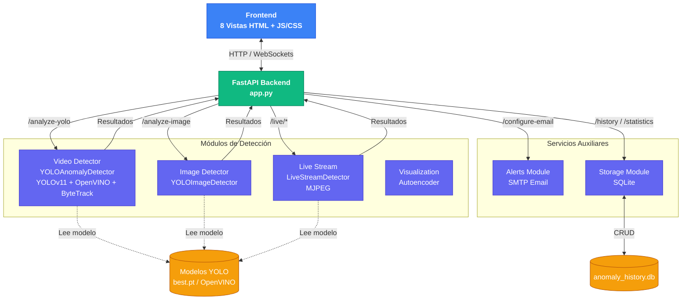
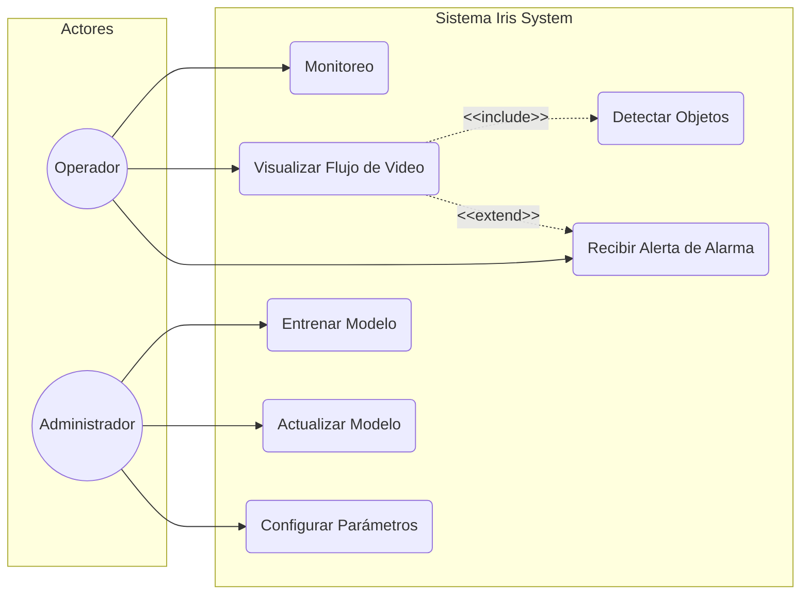
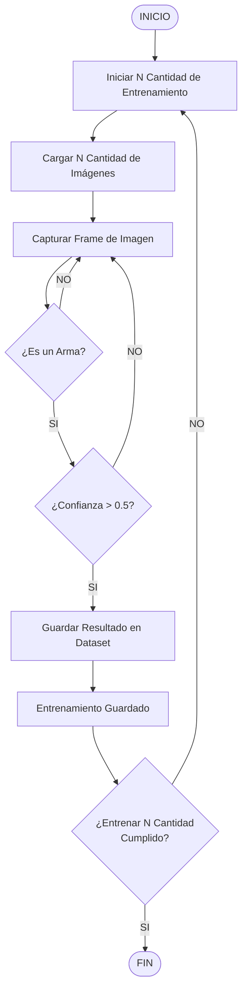
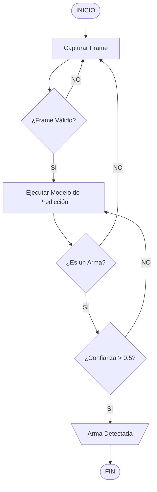
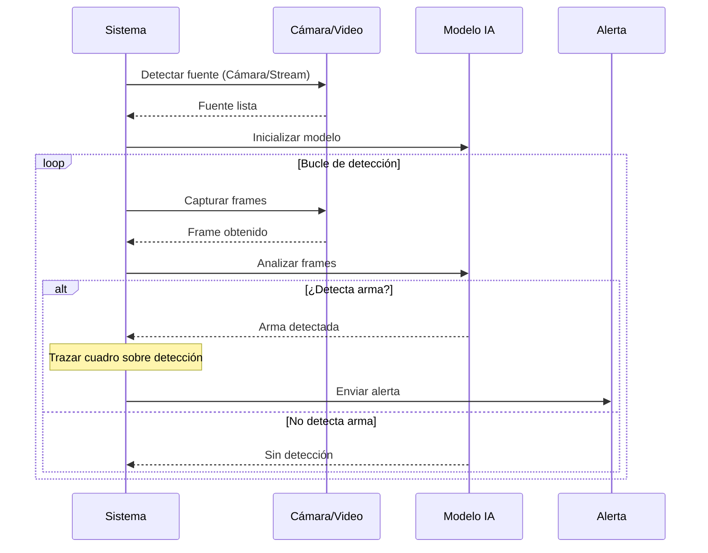
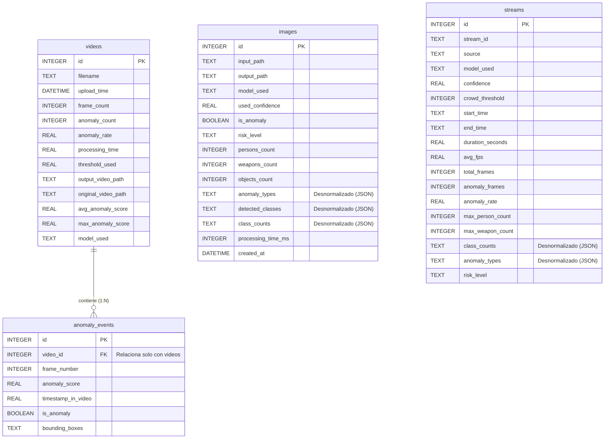

# 📹 Sistema de detección de amenazas en entornos de seguridad - CCTV

Este proyecto es un fork del repositorio [CCTV_Video_Anomaly_Detection](https://github.com/saadkhan2003/CCTV_Video_Anomaly_Detection), sistema de detección de anomalías de vídeo de alto rendimiento, impulsado por IA, diseñado para videovigilancia CCTV. Utiliza YOLOv11 con optimización OpenVINO para la detección en tiempo real en CPU estándar, e incluye una interfaz web y funciones de alerta de anomalías.

---
## 🏗️ Arquitectura del Sistema


---
## 📈 Diagramas del Sistema

### 1. Diagrama de Casos de Uso


### 2. Diagrama de Flujo: Captura de Objetos para Entrenamiento (Armas)


### 3. Diagrama de Flujo: Detección de Objetos en Producción (Armas)


### 4. Diagrama de Secuencia de Detección


### 5. Diagrama de Entidad-Relación (Base de Datos)



La base de datos SQLite (`anomaly_history.db`) consta de 4 tablas:

| Tabla | Propósito | Relaciones |
|---|---|---|
| `videos` | Metadata de cada video analizado (filename, frames, scores, rutas) | Padre de `anomaly_events` |
| `anomaly_events` | Un registro por frame con score de anomalía y bounding boxes (JSON) | Hijo de `videos` (FK: `video_id`) |
| `images` | Registro de cada imagen analizada (rutas, conteos, clases, nivel de riesgo) | Tabla independiente (Desnormalizada) |
| `streams` | Resumen de cada sesión de stream en vivo (duración, FPS, conteos) | Tabla independiente (Desnormalizada) |

> 💡 **Nota de Diseño — Estrategia de Persistencia Híbrida:**
>
> Para optimizar el rendimiento y la escalabilidad del sistema, se utiliza un enfoque híbrido de persistencia:
>
> 1. **Relacional (Normalizado 1:N) para Videos:** Dado que los videos se analizan secuencialmente frame a frame, se registran eventos individuales en `anomaly_events`. Esto permite trazar curvas de anomalías temporales y auditar detalladamente qué pasó en cada segundo.
 > 2. **Documental/Desnormalizado (JSON) para Imágenes:** Una imagen es un evento único y estático. Guardar detecciones en una tabla separada agregaría joins innecesarios. Se almacena toda la información de manera autocontenida usando cadenas JSON en `anomaly_types`, `detected_classes`, y `class_counts`.
> 3. **Documental/Desnormalizado (JSON) para Streams:** El procesamiento de transmisiones en vivo ocurre a altos FPS continuos. Almacenar un registro por frame en `anomaly_events` causaría un crecimiento exponencial y degradación del disco. Al finalizar la sesión, se persiste únicamente el resumen acumulado en `streams` con sus clases agrupadas en formato JSON (`class_counts`, `anomaly_types`).
---

## 🛠️ Inicio Rápido

### 📋 Pre-requisitos

Antes de comenzar, asegúrate de cumplir con los siguientes requerimientos en tu entorno local:

- **Python**: 3.10 o superior
- **Operating System**: Windows 10+ / Ubuntu 22.04 / macOS 12+
- **RAM**: 8 GB mínimo (16 GB recomendado)
- **Storage**: Al menos 10 GB de espacio libre (para dependencias y modelos)

### 🚀 Instalación

Sigue estos pasos en tu terminal para clonar el proyecto y preparar tu entorno de desarrollo:

1. **Clonar el repositorio**
   ```bash
   git clone https://github.com/Sibahia/Iris-System-Detector-IA.git
   cd Iris-System-Detector-IA
   ```

2. **Crear el entorno virtual (Altamente recomendado)**
    ```bash
    python -m venv venv
    ```

    - **Activar en Linux/macOS:**
        ```bash
        source venv/bin/activate
        ```

    - **Activar en Windows:**
        ```bash
        .\venv\Scripts\Activate.ps1
        ```

3. **Instalar las dependencias**
    ```powershell
    pip install -r requirements.txt

    Nota: La primera instalación puede tardar unos minutos mientras descarga librerías pesadas como OpenVINO o parches de procesamiento de video.
    ```

### Primera Prueba (First Run)

Para verificar que todo el sistema base e interfaces funcionen correctamente después de tus modificaciones:

1. **Iniciar el servidor backend/aplicación**
    ```python
    python app.py
    ```

        Nota importante: En esta primera ejecución, el script descargará automáticamente el modelo base YOLOv11 (~50MB) y realizará la conversión inicial al formato optimizado de OpenVINO (puede tardar de 1 a 2 minutos).

2. **Acceder al Dashboard**
    Abre tu navegador web e ingresa a la siguiente dirección local:
    ```plaintext
    http://localhost:
    ```

3. **Prueba de análisis rápida**

    - Ve a la pestaña "Analyze".

    - Sube un video corto de prueba (formatos soportados: .mp4, .avi, .mov).

    - Deja los parámetros por defecto y haz clic en "Start Analysis".

    - Comprueba que el procesamiento avance en tiempo real y devuelva los recuadros de detección de anomalías sin errores en la consola.

---

## 🐳 Despliegue con Docker

Este proyecto cuenta con soporte nativo para contenedores Docker mediante **Docker Compose**, lo que facilita su despliegue y actualización en cualquier entorno sin necesidad de configurar Python o instalar dependencias de sistema manualmente.

### 📋 Pre-requisitos
- **Docker** instalado y en ejecución.
- **Docker Compose** instalado.

### 🚀 Construir y Ejecutar el Contenedor
Para levantar la aplicación por primera vez o después de realizar cambios en el código:
```bash
docker compose up -d --build
```
Este comando se encarga de:
1. Descargar e instalar la imagen base con OpenCV y dependencias necesarias.
2. Compilar e instalar los paquetes de `requirements.txt`.
3. Iniciar el backend con FastAPI expuesto en el puerto `8000`.

### 🔄 Cómo Actualizar el Contenedor (cctv_ia_test)
Cuando realices cambios en el código base o actualices dependencias en `requirements.txt`, ejecuta el siguiente comando para reconstruir la imagen y reiniciar el contenedor de manera transparente:
```bash
docker compose up -d --build
```
*Esto detendrá el contenedor actual, reconstruirá únicamente las capas que hayan cambiado y levantará el nuevo contenedor en segundo plano.*

### 🛑 Detener el Contenedor
Para pausar o detener el servicio de forma limpia:
```bash
docker compose down
```

### 📂 Persistencia de Datos y Volúmenes
El archivo `docker-compose.yml` mapea volúmenes clave para asegurar la persistencia y permitir cambios rápidos en el diseño sin reconstruir la imagen:

| Origen (Host) | Destino (Contenedor) | Propósito |
|---|---|---|
| `./src/storage/anomaly_history.db` | `/app/src/storage/anomaly_history.db` | Historial de análisis persistente (SQLite) |
| `./static` | `/app/static` | Almacenamiento de videos, fotos e inferencias procesadas |
| `./templates` | `/app/templates` | Vistas HTML dinámicas para modificaciones en tiempo de diseño |

---
